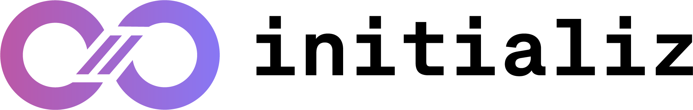

<div align="center">



### The enterprise control plane for AI agents

Orchestration, governance, and observability for AI agents in production.

[](https://initializ.ai)
[](https://useforge.ai/docs/)
[](https://discord.gg/PtFa4z97Ag)

</div>

---

We build the platform that lets enterprises run AI agents the way they run everything else in production: governed, observable, and secure. Agents are defined in plain English with **AgentSkills**, run anywhere, and operate under policy — acting *on behalf of* your people, with a full audit trail.

Our work spans two connected projects: **Forge**, the open-source runtime for building and running agents, and **initializ**, the enterprise control plane that governs them at scale.

## ⚒️ Forge — the open-source agent runtime

[](https://github.com/initializ/forge)

[**Forge**](https://github.com/initializ/forge) is a secure, portable AI agent runtime. Define an agent in a single `SKILL.md` file, then run it locally, in a container, in Kubernetes, or fully air-gapped — the same agent, anywhere, with no inbound tunnels to expose.

- **60-second setup** — `forge init` configures provider, keys, channels, and skills
- **Secure by default** — outbound-only connections, egress allowlists, encrypted secrets
- **Portable** — runs local, Docker, Kubernetes, or air-gapped with local models
- **Observable** — structured audit logs with correlation IDs for every action
- **Extensible** — add skills, tools, channels, and providers without touching core

```bash
# Install
curl -sSL https://raw.githubusercontent.com/initializ/forge/main/install.sh | bash

# Build and run an agent
forge init my-agent && cd my-agent && forge run
```

<div align="left">

[](https://github.com/initializ/forge)
[](https://github.com/initializ/forge/blob/main/LICENSE)

</div>

## 🛡️ initializ — the enterprise control plane

Forge gives teams a way to build and run agents. **initializ** gives the organization a single place to govern them.

It's the control plane for AI agents in production: agent identity and delegated access across your SaaS systems, policy and guardrails, role-based access, and end-to-end observability — so agents can do real work across the enterprise while staying auditable and compliant.

→ **[See the platform at initializ.ai](https://initializ.ai)**

## How they fit together

| | Forge | initializ |
|---|---|---|
| **What** | Open-source agent runtime | Enterprise control plane |
| **For** | Developers building agents | Organizations running agents at scale |
| **Gives you** | Build, run, deploy anywhere | Governance, identity, observability |
| **License** | Apache 2.0, open source | Commercial platform |

## Connect

- 🌐 Platform — [initializ.ai](https://initializ.ai)
- 📚 Forge docs — [useforge.ai/docs](https://useforge.ai/docs/)
- 💬 Community — [Discord](https://discord.gg/PtFa4z97Ag)
- ⚒️ Source — [github.com/initializ/forge](https://github.com/initializ/forge)

<div align="center">

<sub>Built by initializ · Govern AI agents in production</sub>

</div>
